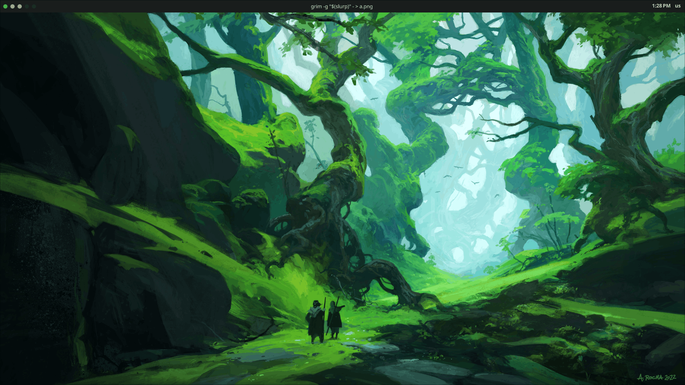

<h1 align="center">Pablo Dotfiles 💽</h1>

<div align="center">


</div>

---



> Wallpapers info [here](./NyxWallpapers/README.md).


Personal dotfiles for Arch Linux featuring a modern Hyprland setup with dynamic theming, managed by [chezmoi](https://www.chezmoi.io/) for consistent deployment across multiple machines.

## ✨ Features

- **🎨 Dynamic Theming** - Automatic light/dark mode with system-wide color synchronization
- **🖥️ Multi-Monitor Support** - Separate configurations for desktop and laptop setups
- **📦 Modular Configuration** - Clean, organized configs split by functionality
- **🔄 Template-Based** - Machine-specific configs generated automatically via chezmoi
- **⚡ Modern Wayland Stack** - Hyprland compositor with custom Quickshell bar
- **🛠️ Developer-Focused** - Neovim with LSP, DAP, and modern plugin ecosystem
- **🔧 One-Command Setup** - Automated installation with backup of existing configs

## 📦 What's Inside

- **[Hyprland](dot_config/hypr/README.md)** - Wayland compositor with modular configuration
- **[Neovim](dot_config/nvim/readme.md)** - Modern IDE setup with LSP, Treesitter, and debugging
- **[Quickshell](dot_config/quickshell/README.md)** - Custom QML-based status bar
- **Kitty** - GPU-accelerated terminal emulator
- **Zsh** - Shell with Powerlevel10k and Zinit plugin manager
- **Rofi** - Application launcher

> 📚 Applications with their own detailed README are linked above.

## 🚀 Quick Start

### One-Line Installation

>[!IMPORTANT]
> Only for Arch Linux. The script was made for my machines and may require adjustments for yours.

>[!NOTE]
> Existing configurations for `hypr`, `quickshell`, `kitty`, `nvim`, or `rofi` will be backed up to `$HOME/.backups_dotfiles/<timestamp>`

```bash
bash -c "$(curl -fsSL https://raw.githubusercontent.com/PabloCruzval/dotfiles/refs/heads/main/setup.sh)"
```

### What the installer does:
1. Installs required packages from `pkglist` and `aurlist`
2. Installs chezmoi if not present
3. Backs up existing configurations
4. Initializes chezmoi with this repository
5. Applies configurations with machine-specific templates

## 📋 Requirements

- **OS**: Arch Linux
- **Display Server**: Wayland
- **Package Managers**: `pacman` and an AUR helper (`yay` or `paru`)
- **Fonts**: Nerd Fonts (installed automatically)
- **Dependencies**: Listed in `pkglist` and `aurlist`

## 📁 Structure

The repository is organized with chezmoi naming conventions:

| What | Where | Description |
|------|-------|-------------|
| **Hyprland** | `dot_config/hypr/` | Modular Wayland compositor config with templates |
| **Neovim** | `dot_config/nvim/` | LSP, DAP, and plugin configurations |
| **Quickshell** | `dot_config/quickshell/` | Custom QML status bar with services |
| **Kitty** | `dot_config/kitty/` | Terminal emulator config |
| **Rofi** | `dot_config/rofi/` | Application launcher |
| **Themes** | `dot_config/themes/` | Theme definitions (JSON) |
| **Scripts** | `dot_local/bin/` | Utility scripts (nyx-theme) |
| **Wallpapers** | `NyxWallpapers/` | Wallpaper collection |

> 💡 **Chezmoi naming**: `dot_` → `.` (hidden files), `.tmpl` → template, `executable_` → executable bit

---

## 🎯 Key Features

<details>
<summary><b>🎨 Dynamic Theming</b></summary>

<br>

Automated theme system with time-based switching and manual toggle support.

**Features:**
- 🌅 **Auto Light/Dark** - Switches automatically at 6am (light) and 8:30pm (dark)
- 🔄 **Login Sync** - Applies correct theme based on current time at startup
- ⌨️ **Quick Toggle** - `SUPER + T` to manually switch themes
- 🎯 **System-Wide** - Affects Hyprland, Quickshell, GTK apps, and notifications

**Available Themes:**
- `dark_green` - Dark theme with green accents
- `light_green` - Light theme with green accents

**Usage:**
```bash
nyx-theme apply dark_green   # Apply specific theme
nyx-theme toggle             # Toggle between light/dark
nyx-theme sync               # Sync theme based on current time
```

**Automatic Switching:**
```bash
# Enable systemd timers for automatic theme changes
systemctl --user enable --now theme-light.timer theme-dark.timer
```

> 📖 For detailed documentation, see [Theme System README](dot_config/themes/README.md)

</details>

<details>
<summary><b>🖥️ Multi-Machine Support</b></summary>

<br>

Chezmoi templates automatically adapt configurations based on machine name:

```conf
{{- if eq .machinename "cnyx" }}
source = ~/.config/hypr/modules/monitors-desktop.conf
{{- else}}
source = ~/.config/hypr/modules/monitors-laptop.conf
{{- end }}
```

Same source, different output per machine!

</details>

---

## 🔧 Managing Your Dotfiles

<details>
<summary><b>📝 Making Changes</b></summary>

<br>

**Direct editing (recommended):**
```bash
chezmoi cd                               # Navigate to source
nvim dot_config/hypr/hyprland.conf.tmpl  # Edit files
chezmoi apply                            # Apply changes
git add . && git commit -m "Update"      # Commit
git push                                 # Push
```

**Quick edit:**
```bash
chezmoi edit ~/.config/hypr/hyprland.conf
chezmoi apply
```

</details>

<details>
<summary><b>🔄 Syncing Across Machines</b></summary>

<br>

**Machine A (send changes):**
```bash
cd ~/.local/share/chezmoi
git add . && git commit -m "Update" && git push
```

**Machine B (receive updates):**
```bash
chezmoi update  # Pulls and applies changes
```

</details>

<details>
<summary><b>➕ Adding New Files</b></summary>

<br>

```bash
chezmoi add ~/.config/app/config.conf
# Creates: ~/.local/share/chezmoi/dot_config/app/config.conf
```

</details>

<details>
<summary><b>🔍 Quick Reference</b></summary>

<br>

```bash
chezmoi managed   # List all managed files
chezmoi diff      # Show differences
chezmoi apply     # Apply changes
chezmoi update    # Pull and apply
chezmoi cd        # Go to source directory
```

</details>

---

## 🎨 Customization

Each major component has detailed documentation:
- **[Hyprland](dot_config/hypr/README.md)** - Compositor, keybindings, modules
- **[Neovim](dot_config/nvim/readme.md)** - Plugins, LSP, DAP
- **[Quickshell](dot_config/quickshell/README.md)** - Bar, widgets, services

<details>
<summary><b>Common Tasks</b></summary>

<br>

**Change themes:**
```bash
nvim ~/.config/themes/dark_green.json
nyx-theme apply dark_green
```

**Adjust monitors:**
```bash
nvim ~/.local/share/chezmoi/dot_config/hypr/modules/monitors-desktop.conf
chezmoi apply
```

**Modify keybindings:**
```bash
nvim ~/.local/share/chezmoi/dot_config/hypr/modules/keybindings.conf
chezmoi apply
```

</details>

---

## 🤝 Contributing

While this is a personal configuration, contributions are welcome!

If you find bugs or have suggestions:
1. Fork the repository
2. Create a feature branch (`git checkout -b feature/improvement`)
3. Commit your changes (`git commit -am 'Add improvement'`)
4. Push to the branch (`git push origin feature/improvement`)
5. Open a Pull Request

---

## 🙏 Credits

This configuration draws inspiration from the excellent work of the community:

- **[@end-4](https://github.com/end-4)** - For the amazing [dots-hyprland](https://github.com/end-4/dots-hyprland) which inspired the Quickshell architecture and provided the foundation for KeyboardService
- **[@caelestia](https://github.com/caelestia-dots)** - For additional Quickshell design patterns and inspiration from [caelestia-shell](https://github.com/caelestia-dots/shell). also inspired the look and feel of this Readme file.

Special thanks to the Hyprland and Quickshell communities for their continuous support and excellent tools!

---

## ⚠️ Important Notes

**Before using these dotfiles:**
- These configurations are tailored to my workflow and hardware
- You may need to adjust:
  - Monitor configurations and resolutions
  - Input device settings
  - Application paths and preferences
  - Machine names in templates

**Disclaimer:** Don't blindly use these settings. Review and understand what each configuration does before applying.

---

## 📄 License

This project is open source and available under the [MIT License](LICENSE).

You are free to use, modify, and distribute these configurations. Attribution is appreciated but not required.

---

<div align="center">

**Maintained by [@PabloCruzval](https://github.com/PabloCruzval)**

For issues or questions, feel free to [open an issue](https://github.com/PabloCruzval/dotfiles/issues)

⭐ Star this repo if you find it useful!

</div>
